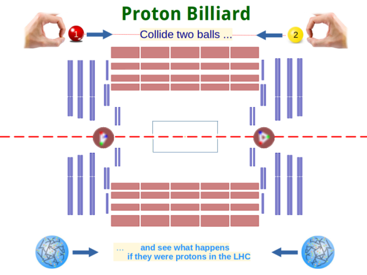

<head>
  <style>
     body {
          margin-left:20px;
	  text-align:justify;
	  max-width:55em;
          font-family:Helvetica, Sans-Serif;
          color:black;
          background-color:White;
     }
  </style>
</head>

****************************************
## Project **p(roton)p(roton) Billiard**
****************************************


About
-----

Uses video tacking of colliding round colored objects to determine parameters
of collision like the equivalent centre-of-mass energy, impact parameter and
asymmetry. These are scaled to correspond to the parameters of a proton-proton 
collision in a high-energy collider and pictures of the traces resulting from 
particle collision are shown. 

The Python Code relies on the Open Source Computer Vision Library 
[OpenCV](https://opencv.org/). Thanks to the developers for the 
great work!

>   


Created by Guenter Quast, initial Version Aug. 2022 

###Installation:

On a standard Python (>3.6) environment the OpenCV library 
is installed via the command  
> `pip3 install opencv-python`.

After downloading the ppBilliard package, type 
`ppBilliard.py -h`, producing the following output:

```
  usage: ppBilliard.py [-h] [-f] [-v VIDEO] [-b BUFFER] [-s SOURCE]
                       [-c CALIBRATE]

  optional arguments:
    -h, --help            show this help message and exit
    -f, --fullscreen      run in fullscreen mode
    -v VIDEO, --video VIDEO
                          path to the (optional) video file
    -b BUFFER, --buffer BUFFER
                          max buffer size for object traces
    -s SOURCE, --source SOURCE
                          videodevice number
    -c CALIBRATE, --calibrate CALIBRATE
                          find hsv range of trackable object <1/2>
```

Usually, the number of the video device for the webcam is 0; if 
not, use the parameter '-s n' with the device number 'n'.


### Purpose of the Program

Starting the Program without any other arguments than the device number 
will display a short trailer and then switch to a display of the webcam
output. If a trackable object like a colored ball or circle is identified, 
it is replaced by a symbolic, animated representation of a proton
and tracked in the video as you move it around.

If no object is recognized, a calibration step is needed. Close
the Program by typing <esc> or 'q' in the video window and restart
with the parameter '-c1' to set the parameters for the first object
in the so-called 'hsv color space' (hue, saturation, value). 
The procedure is interactive in a graphical window - adjust the
silders for minimum and maximum hsv value such that only the object 1 
is clearly visible in the right video window. Type 's' in the video
window to store the parameters for object 1. Repeat the same
procedure for the second object with parameter '-c2'; note that the
second object must must have color different from object 1!

Restart the program and move the objects around.  The objects 
should now be recognized and their round shapes replaced by a
symbolic, animated pictures of protons, and the object paths 
are drawn on the video. If these traces come closer than the
sum of the radii of the two objects, a "collision" is detected
and the collision parameters are printed (the equivalent centre-of-mass
energy, the impact parameter and the asymmetry, in units 
of pixels for space, time difference between frames for time
and for unit mass). In addition, an event picture from the
[CMS Detector](https://cms.cern) at CERN appears on the
video screen. 
Type 'c' in the video window to restart, <esc> or 'q' to exit.


#### Further ideas

This is just an initial version intended as a demonstrator. 

The "objects" in a final version should be real objects on a 
play field which are kicked by two players. The play field
might be simple board for a mobile version, or a true play 
ground with (colored) footballs in a sports field.
(Although placing the camera in the latter scenario may 
be a challenge). 

The selection of collision images could be much more sophisticated,
e.g. by making the produced particle interaction depend on the
speed and centrality of the collision. As a result, a true competition 
of teams for the largest harvest of of interesting events could arise.

The present selection of collision events from the CMS experiment 
can be replaced by collections of images other sources.

**Please contribute!**


