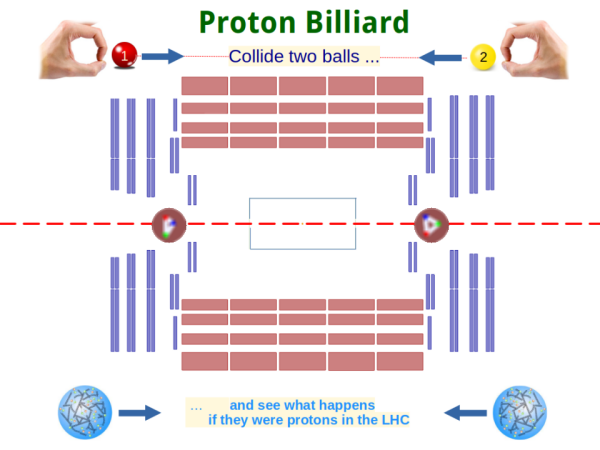

.. ppBilliard documentation master file, created by
   sphinx-quickstart on Mon Aug 22 11:25:28 2022.
   You can adapt this file completely to your liking, but it should at least
   contain the root `toctree` directive.

========================
ppBilliard Documentation
========================

.. toctree::
   :maxdepth: 2
   :caption: Contents:

	     
About
-----

*p(roton) p(roton) Billiard*: Collide two balls on a table and see
what happens if they were protons in the Large Hadron Collider at CERN.

This project uses a table-top game board for video tacking of colliding
round colored objects with a webcam.
Collision parameters like the equivalent centre-of-mass energy,
impact distance and asymmetry are automatically determined.
These are scaled to correspond to the parameters of a proton-proton 
collision in a high-energy collider and pictures of the traces resulting
from  particle collision are shown. 

The Python Code relies on the Open Source Computer Vision Library 
[OpenCV](https://opencv.org/).

Created by: 

* Guenter Quast <guenter (dot) quast (at) online (dot) de>

.. toctree::
   :maxdepth: 2

.. |date| date::

	  
Module Documentation 
====================

..  automodule:: ppBilliard
     :members:

Indices and tables
==================

* :ref:`genindex`
* :ref:`modindex`
* :ref:`search`
